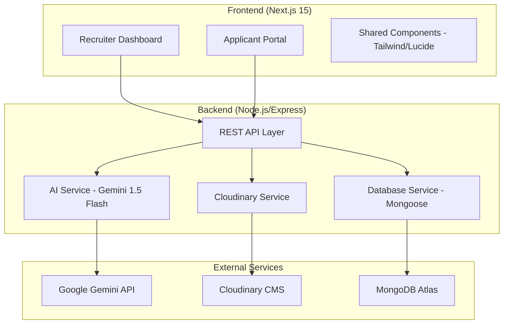

# Umurava AI - Intelligent Recruitment & Screening Platform

Umurava AI is a state-of-the-art recruitment ecosystem designed to streamline the hiring process using Generative AI. It automates candidate screening, job description extraction, and talent pool management, providing recruiters with data-driven insights and a seamless workflow.

## 🔗 Live Deployment
- **URL**: [https://umurava-41e9.vercel.app/](https://umurava-41e9.vercel.app/)

## 🏗️ System Architecture

The platform follows a decoupled architecture with a high-performance Next.js frontend and a robust Node.js/Express backend, integrated with Google Gemini AI for intelligent processing.



## 🚀 Current Features

- **Gemini-Powered Candidate Ranking**: Automated 1-100 scoring based on Skills (40%), experience (30%), Education (20%), and Documents (10%).
- **AI-Driven Job Extraction**: Instantly populate job specs by uploading PDF/DOCX files.
- **Cloudinary Integration**: Permanent and secure cloud storage for all resumes and profile photos.
- **Recruiter Decision Suite**: Dynamic actions for Interviewing, Hiring, or Rejecting with visual state feedback.
- **Applicant Leaderboard**: Transparent ranking visibility for shortlisted talent to encourage engagement.
- **Export Engine**: boardroom-ready PDF and Excel reports of candidate rankings and talent pools.
- **Identity Hydration**: Session-based profile management for a personalized experience.
- **Mobile-Responsive UI**: Fully optimized experience across all modern device screen sizes.

## 🗺️ Documentation Map

To understand the system in depth, please refer to the following documentation files:

### ⚙️ Core Technical Docs (Root `docs/`)
- **[DEEP_SCREENING_ANALYSIS.md](file:///d:/umurava/docs/DEEP_SCREENING_ANALYSIS.md)**: Algorithmic breakdown of how Gemini scores and ranks candidates.
- **[TECHNICAL_DOCUMENTATION.md](file:///d:/umurava/docs/TECHNICAL_DOCUMENTATION.md)**: Full-stack codebase overview and system capabilities.
- **[RESUME_INGESTION_FLOW.md](file:///d:/umurava/docs/RESUME_INGESTION_FLOW.md)**: Detailed mapping of the file-to-data extraction pipeline.
- **[FEATURES.md](file:///d:/umurava/docs/FEATURES.md)**: Comprehensive guide to all platform features.
- **[AI_DECISION_FLOW.md](file:///d:/umurava/docs/AI_DECISION_FLOW.md)**: High-level overview of AI logic.
- **[AUTHENTICATION.md](file:///d:/umurava/docs/AUTHENTICATION.md)**: Security protocols (JWT, Bcrypt) and session management.
- **[SCHEMA_OVERVIEW.md](file:///d:/umurava/docs/SCHEMA_OVERVIEW.md)**: Unified view of MongoDB data models.
- **[SETUP.md](file:///d:/umurava/docs/SETUP.md)**: Step-by-step developer environment configuration.
- **[STABILITY.md](file:///d:/umurava/docs/STABILITY.md)**: Error handling, rate limiting, and performance strategies.

### 🗄️ Backend & Operational Docs (`backend/docs/`)
- **[Umurava_Updates_Doc.md](file:///d:/umurava/backend/docs/Umurava_Updates_Doc.md)**: Narrative of recent technical migrations and interface upgrades.
- **[DATABASE.md](file:///d:/umurava/backend/docs/DATABASE.md)**: Definition of the 15 primary MongoDB schemas.
- **[API_REFERENCE.md](file:///d:/umurava/backend/docs/API_REFERENCE.md)**: Documentation for REST API endpoints.
- **[FRONTEND_INTEGRATION.md](file:///d:/umurava/backend/docs/FRONTEND_INTEGRATION.md)**: Guide on API consumption and data flow to the UI.
- **[ARCHITECTURE.md](file:///d:/umurava/backend/docs/ARCHITECTURE.md)**: Backend-specific architecture notes.

---

## 🛠️ Setup Instructions

### 1. Backend Setup
1. Navigate to the backend directory:
   ```bash
   cd backend
   ```
2. Install dependencies:
   ```bash
   npm install
   ```
3. Start the server:
   ```bash
   npm run dev
   ```

### 2. Frontend Setup
1. Return to the root directory:
   ```bash
   cd ..
   ```
2. Install dependencies:
   ```bash
   npm install
   ```
3. Start the development server:
   ```bash
   npm run dev
   ```
4. Access the app at `http://localhost:4028`.

## 🔑 Environment Variables

### Backend (`backend/.env`)
| Variable | Description |
| --- | --- |
| `PORT` | Server port (default: 5000) |
| `MONGODB_URI` | MongoDB connection string |
| `GEMINI_API_KEY` | Your Google Gemini API Key |
| `CLOUDINARY_URL` | Cloudinary connection string |
| `JWT_SECRET` | Secret key for JWT authentication |

### Frontend (`.env`)
| Variable | Description |
| --- | --- |
| `NEXT_PUBLIC_API_URL` | URL of the backend API |

## ⚠️ Assumptions and Limitations

- **File Types**: AI direct processing is optimized for PDF. DOCX files use a text-extraction fallback.
- **Rate Limits**: The system implements batching and exponential backoff to handle Gemini API quotas.
- **Language**: Optimization is focused on English; accuracy may vary for other languages.

## 📄 License
Internal Development - Umurava AI.

