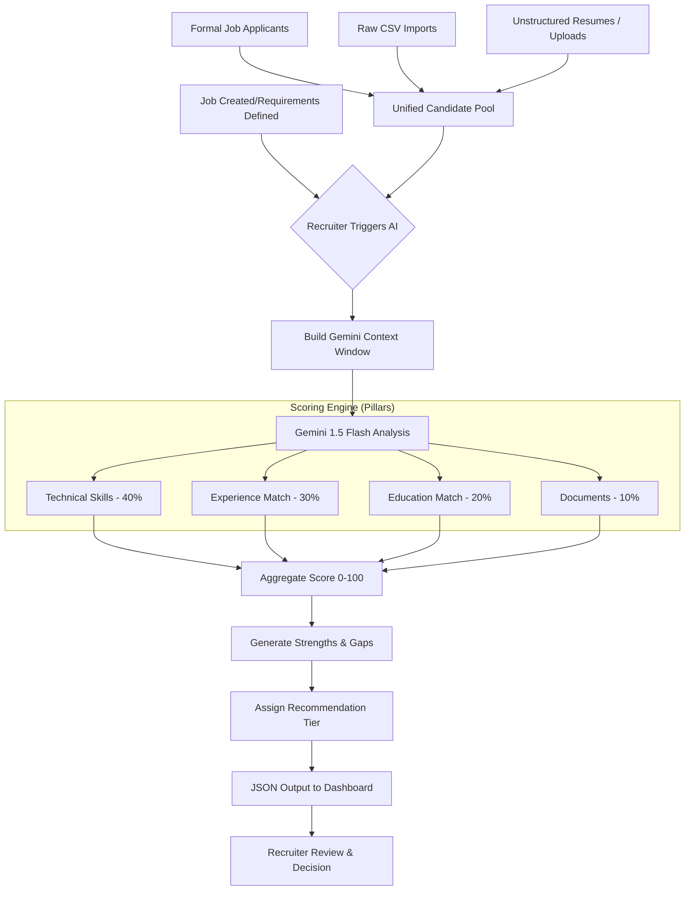

# AI Decision Flow - UMURAVA SCREENING AI

This documentation explains how AI (Gemini 1.5 Flash) is orchestrated to ensure transparent, accurate, and efficient candidate screening.

## 🏗️ Logical Flow Diagram

## 1. The Decision Engine
The core of the system is the **Gemini 1.5 Flash API**, which acts as an expert HR evaluator. Flash was chosen for its low latency and multimodal capabilities, allowing direct ingestion of PDF files.

## 2. Advanced Power Features
- **AI Interview Question Generator**: Automatically generates 3 tailored interview questions per candidate based on their specific skill gaps discovered during screening.
- **Head-to-Head Comparison**: Side-by-side AI evaluation of two candidates to determine the best fit for a role, outputting a winner and comparative reasoning.
- **Must-Have Skill Prioritization**: Recruiters can flag "Must-Have" skills during job creation. The AI ranking engine is instructed to penalize candidates who lack these core requirements.
- **Cloud-Persistence**: All resumes are permanently stored in **Cloudinary**, with the `resumeUrl` bound to the candidate's profile for instant retrieval.

## 3. Screening Process Flow
1.  **Input Ingestion**: The backend gathers the Job Description and candidate profiles.
2.  **Batching Optimization**: Candidates are processed in batches of 5 to maintain context accuracy and respect Gemini's token/rate limits.
3.  **Weighted Prompt Execution**: A structured prompt is sent to Gemini directing it to score candidates on a 1-100 scale.
4.  **Evaluative Pillars**:
    - **Technical Skills (40%)**: Match between candidate proficiency and job requirements.
    - **Experience (30%)**: Relevance of past roles, company tier, and progression.
    - **Education (20%)**: Academic background and certification relevance.
    - **Document Verification (10%)**: Presence and quality of required materials.
5.  **Ranking**: Candidates are ranked globally across all batches based on the final weighted score.
6.  **Recommendation**: AI assigns a status (`Shortlist`, `Waitlist`, `Reject`) based on the score threshold.

## 4. Transparency & Explainability
- **Strengths & Gaps**: Instead of a simple "yes/no", the AI explicitly lists what the candidate has and what they lack.
- **AI Reasoning**: A natural language paragraph explaining *why* the score was assigned, allowing the human recruiter to verify the AI's logic in the **Candidate Reasoning Drawer**.

## 5. Robustness & Fallbacks
- **Rate-Limit Handling**: The system uses exponential backoff to handle `429` errors.
- **Simulated Screening**: If the AI service is exhausted, a local simulation engine provides basic keyword-based scoring as a temporary fallback to ensure system uptime.
- **Language**: Optimized for English; multi-language support is in the roadmap.
