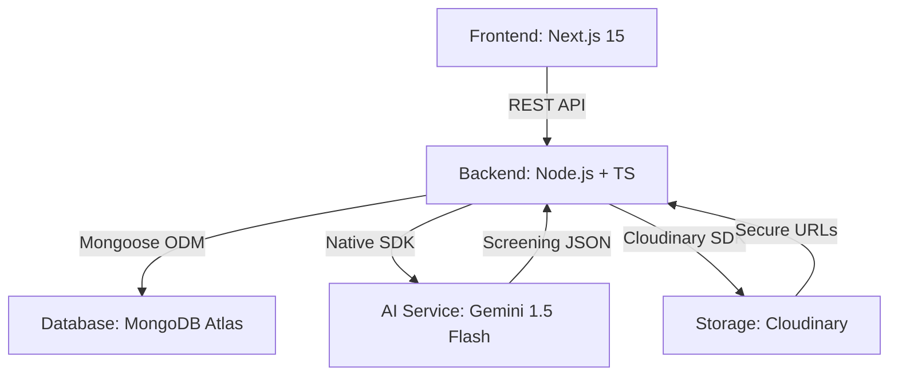

# Architecture Overview - UMURAVA SCREENING AI

## System Architecture

## Core Layers
1.  **API Layer**: RESTful endpoints protected by JWT authentication and documented via Swagger UI for interactive testing.
2.  **AI Orchestration**: Integration with Google Gemini for entity extraction (Resume Parsing) and multi-dimensional candidate ranking (Batch Screening).
3.  **Cloud Storage Layer**: Decoupled binary storage. Resumes and profile photos are persisted in Cloudinary, ensuring a stateless and scalable backend.
4.  **Database Layer**: MongoDB serves as the primary data store for candidate profiles, job specifications, and AI-generated screening results.
5.  **Processing Layer**: Advanced logic for batching AI requests, handling rate limits via exponential backoff, and normalizing unstructured resume data.
