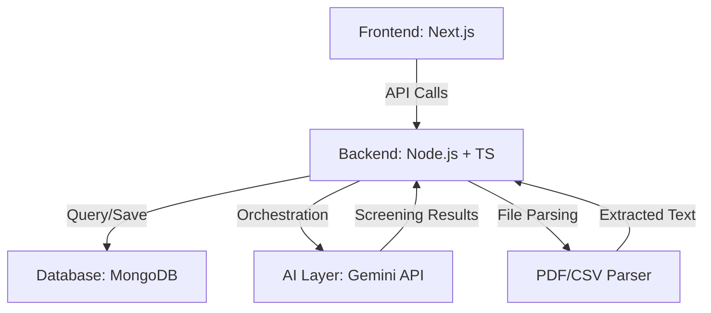

# Architecture Overview - UMURAVA SCREENING AI

## System Architecture

## Layers
1.  **API Layer**: RESTful endpoints protected by JWT and documented with Swagger.
2.  **Processing Layer**: Logic for batching candidates and extracting text from multi-format files.
3.  **AI Orchestration**: Integration with Google Gemini for entity extraction and candidate ranking.
4.  **Database Layer**: Persistent storage for multi-dimensional screening data.
