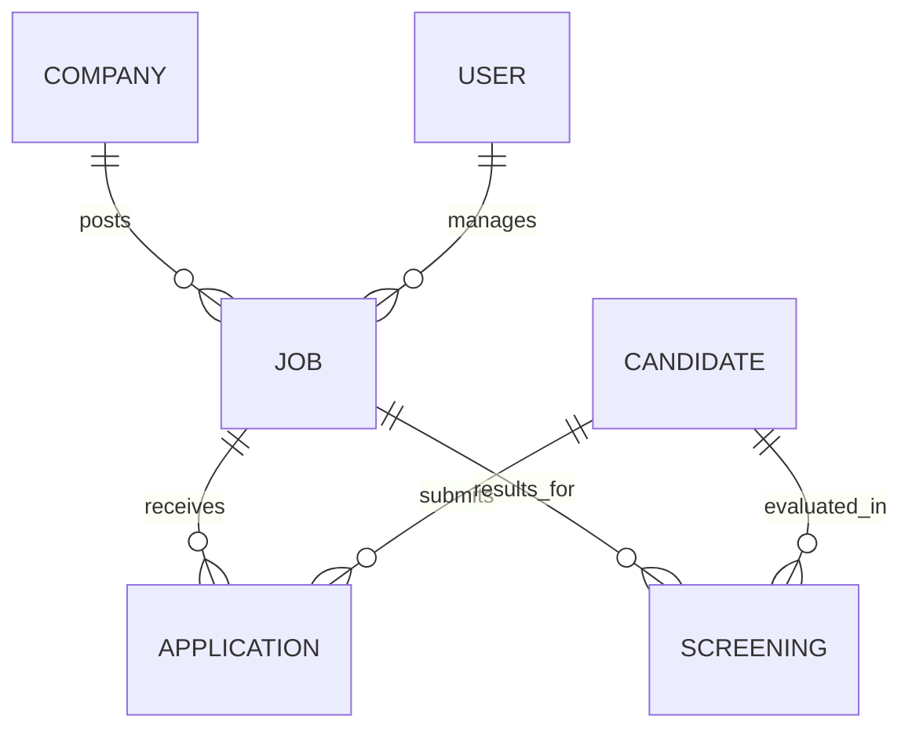

# Database Documentation - UMURAVA SCREENING AI

The system uses **MongoDB Atlas** as its primary database. Below is the ER diagram and the core schemas used in the platform.

## 📐 Entity Relationship Diagram

## 1. User
Manages recruiters and administrators.
- **name**: String
- **email**: String (Unique)
- **password**: String (Hashed)
- **role**: Enum ['recruiter', 'admin']

## 2. Job
Stores job openings and specifications.
- **title**: String
- **description**: String
- **requirements**: String[]
- **skills**: String[]

## 3. Candidate
Stores talent profiles and parsed data extracted via Gemini.
- **firstName**, **lastName**: Strings
- **email**: String (Unique)
- **resumeUrl**: String (Cloudinary link)
- **photoUrl**: String (Cloudinary avatar link)
- **skills**: Array of `{ name, level, type }`
- **extractedText**: Raw text used for AI analysis

## 4. Screening
AI-generated ranking results produced by Gemini 1.5 Flash.
- **jobId**, **candidateId**: References
- **score**, **rank**: Matching metrics
- **weightedScore**: `{ skills (40%), experience (30%), education (20%), documents (10%) }`
- **aiReasoning**: Narrative explanation of the score.
- **strengths**, **gaps**: Qualitative analysis points.
- **interviewQuestions**: AI-curated questions.

## 5. Application
Tracks the hiring lifecycle.
- **status**: Enum ['Applied', 'Shortlisted', 'Interview', 'Hired', 'Rejected']

## 6. Interview
Scheduling and logistics for specific candidates.
- **type**: Enum ['Technical', 'Behavioral', 'HR']
- **scheduledAt**: Date

## 7. Review
Detailed recruiter feedback and scorecards.
- **score**: 0-10 scale
- **recommendation**: Enum ['Pass', 'Fail', 'Strong Pass']

## 8. AuditLog
Security logs tracking critical system actions for compliance.

## 9. Settings
User-specific preferences (Theme, UI settings).
