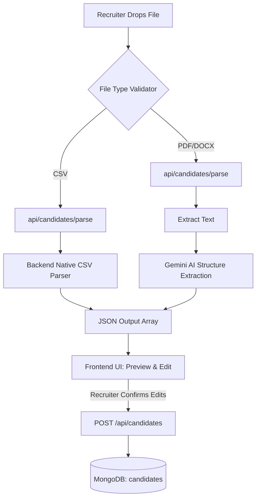

# Resume Ingestion Flow

This document details the architectural flow of how candidate resumes (PDF, DOCX, CSV) are ingested into the Umurava Platform. We deliberately decoupled the **Parsing** engine from the **Database Storage** to introduce a human-in-the-loop validation step via the Recruiter Dashboard.

## Architecture Guidelines

We enforce a Strict Two-Step Ingestion Pipeline:

1. **Extraction (Stateless API)**
   - **Endpoint**: `POST /api/candidates/parse`
   - **Behavior**: The backend receives a `multipart/form-data` payload. It reads the binaries in-memory using Multer.
     - **CSV**: Uses raw backend string parsing capabilities (fast and deterministic).
     - **PDF/DOCX**: Uses `pdf-parse` or `mammoth` to extract OCR text, then pumps the raw text into **Gemini 1.5 Flash**. Gemini performs structured Document Understanding to return rigid schema JSON (Name, Email, Phone, Skills).
   - **Constraint**: *This API never commits anything into MongoDB.*

2. **UI Validation (Recruiter Dashboard)**
   - The React frontend receives the array of extracted Candidate JSON objects.
   - It transitions the `UploadResumeModal.tsx` from "Loading" into a "Preview" editing form.
   - The recruiter visually inspects the extracted data, fixes any AI hallucinations (especially regarding misidentified skills or mangled phone numbers), and clicks Confirm.

3. **Database Commit (Transactional)**
   - **Endpoint**: `POST /api/candidates`
   - **Behavior**: Receives the clean, recruiter-approved JSON list and executes `Candidate.insertMany(candidates)`.

## Flow Diagram

## Assumptions & Limitations
- **Text-Based PDF Requirements**: The `pdf-parse` implementation directly assumes PDFs are structured computationally (like exported from Word or Google Docs). Scanned images, rasterized CVs, or protected binary PDFs are **not supported** natively and will return an error or skip extraction.
- **CSV Headers Mapping**: The extraction dynamically handles arbitrary column names (e.g., matching "years of exp", "experience", "work experience" all to the same `Experience` DB Field), but completely unexpected custom column headers that do fall out of the keyword heuristics will be gracefully merged or skipped.
- **Gemini Free Tier Exhaustion**: Without a premium Google AI API Key, continuous heavy concurrent usages will trigger the internal RegExp local mechanism. AI Parsing is exclusively active successfully within the API rate limits.

## Gemini Fallback Strategy
To protect against strict API Free Tier `429 Too Many Requests` Quota Limits from Google, the `gemini.service.ts` features a transparent `catch` block that defaults to an aggressive local RegExp engine. This ensures backend reliability under load, guaranteeing that even without AI, emails, phones, and common tech stack keywords are parsed successfully without ever breaking the UI Preview layer.
