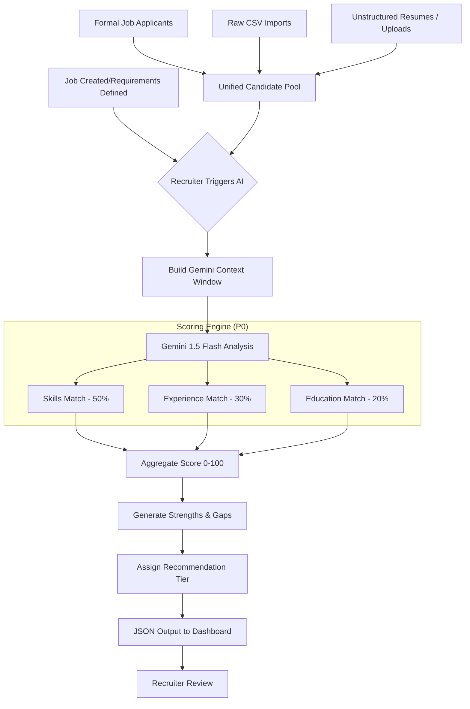

# AI Decision Flow Diagram

This diagram illustrates the logical flow of the Umurava AI Screening engine.

## Flow Description
1.  **Context Injection**: The system injects the full job description and a batch of candidate profiles into the LLM context.
2.  **Weighted Dimension Analysis**: The AI evaluates three distinct dimensions with predefined weights.
3.  **Qualitative Synthesis**: Beyond numbers, the AI synthesizes "Strengths" and "Gaps" to provide actionable explainability.
4.  **Tier Assignment**:
    *   **Shortlist**: Strong alignment (>80%).
    *   **Waitlist**: Potential match with gaps (60-80%).
    *   **Reject**: Significant mismatches (<60%).
