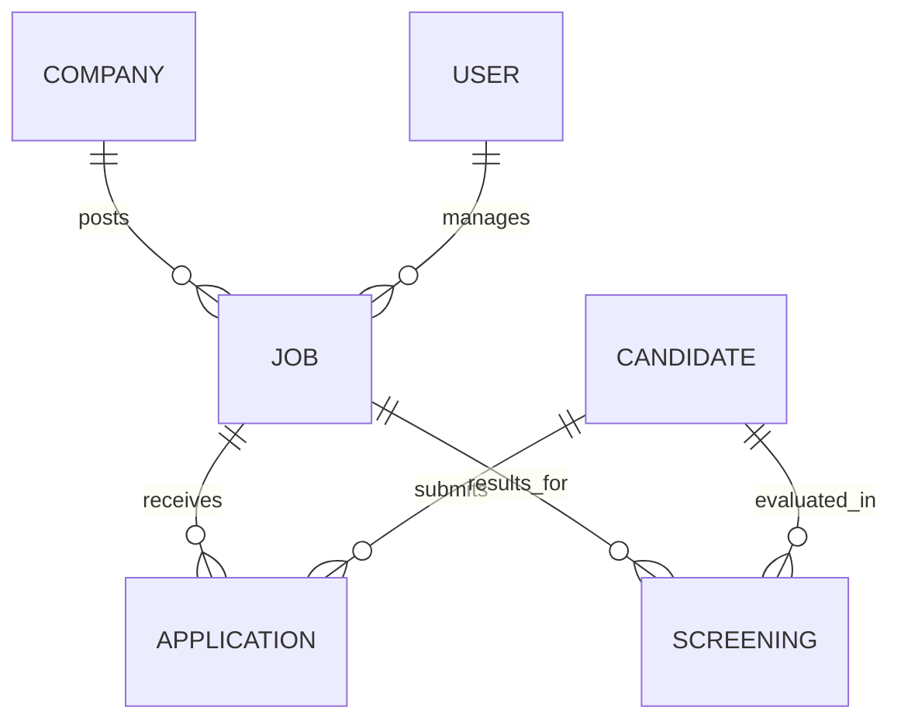

# Umurava AI: Database Schema Overview

This document explains the core data models and their relationships within the Umurava AI Screening platform.

## Model Relationships

## Core Collections

### 1. Job
Represents a recruitment posting.
-   **Key Fields**: `title`, `description`, `skills`, `mustHaveSkills`, `status` (Draft, Active, Closed), `applicantCount`.
-   **Logic**: AI screenings use the `skills` and `mustHaveSkills` arrays to calculate the initial match score.

### 2. Candidate
Represents a professional profile.
-   **Key Fields**: `name`, `skills`, `experience`, `education`, `missingDocuments`.
-   **Missing Documents**: A string array (e.g., `["Degree", "ID"]`) used to flag profiles that require recruiter attention for verification.

### 3. Application
The association between a `Candidate` and a `Job`.
-   **Key Fields**: `jobId`, `candidateId`, `status` (Applied, Screened, Interviewed, Rejected).

### 4. Screening
Stores AI-generated analysis.
-   **Key Fields**: `jobId`, `candidateId`, `score`, `rank`, `recommendation`, `strengths`, `gaps`, `aiReasoning`.
-   **Persistence**: These results are persisted in the database to allow recruiters to view rankings without re-running AI calls unless requested (via the "Re-run" button).

---
## Recruitment Logic
1.  **Application**: Candidates apply for jobs that match their skills.
2.  **Screening**: Gemini AI analyzes the `Job` description against all associated `Candidate` profiles.
3.  **Ranking**: The system calculates a weighted score (Skills 50%, Experience 30%, Education 20%) and assigns a recommendation tier.
